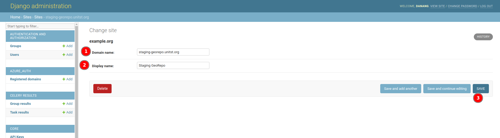
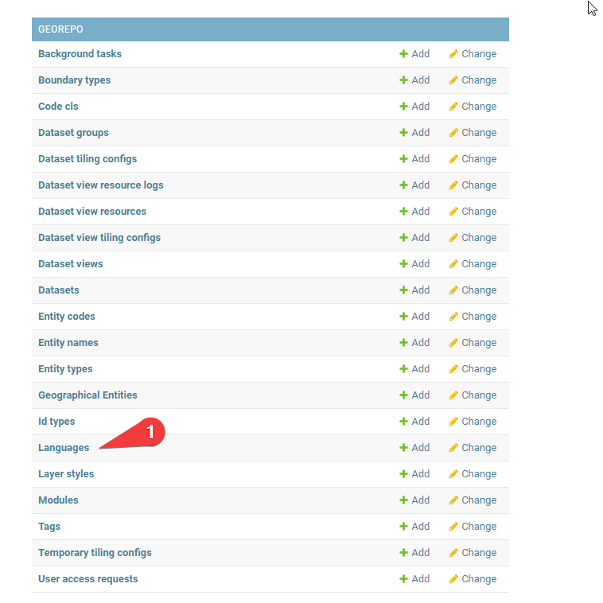
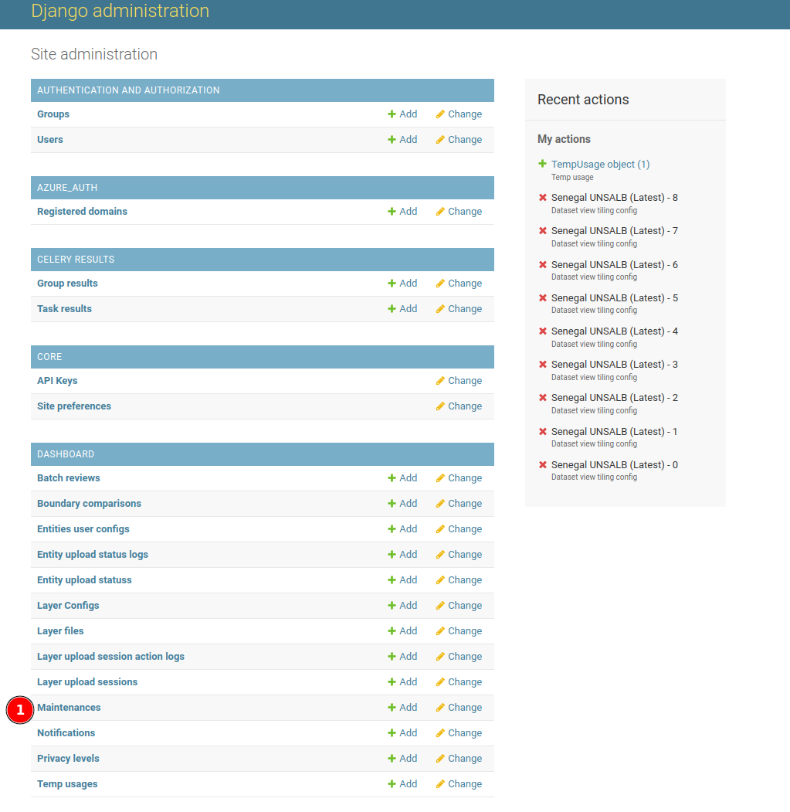
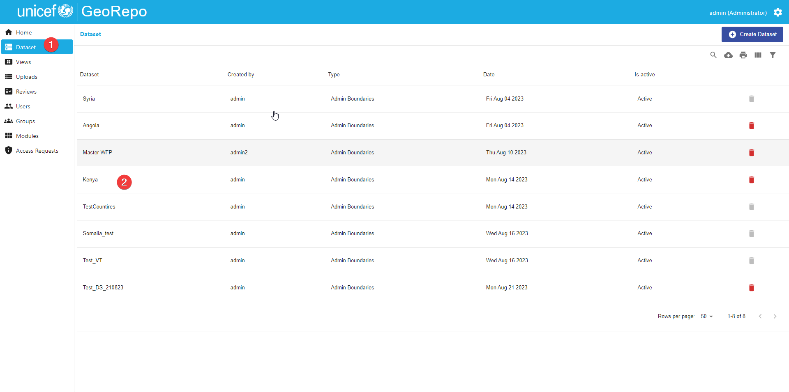
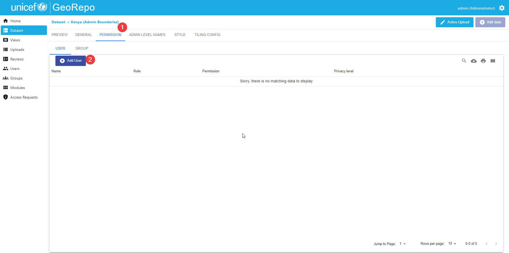

# Administrator Guide
<!-- Narrative Instructions on how admin users will use the product/platform -->
<!-- Replace all of the titles with relevant titles -->

## Configure Site Name Settings

Go to the Django Admin Page and click on `Sites` tab.

Click on row `example.org` to go to the edit page. 

Change the `Domain name` and the `Display name` and then click on the `save` button to save the changes.

## Configure Unicef Group as Default Group for new Unicef User

Go to the Django Admin Page and click on `Registered Domain` tab.

Select the `Unicef Group` for domain `unicef.org` and then click on the `Save` button.

## Configure Site Preferences

Go to the Django Admin Page and click on `Site preferences` tab.

Set the value of `Maptiler api key` that will be used for Map Preview in the dashboard application.

Set the value of `Default admin emails` that will be used for email notification when there is a new sign-up user request and permission access request. Example format: `["admin1@example.org", "admin2@example.org"]`.

## Configure Languages

Go to the Django Admin Page and click on `Languages` tab.

Click on the `Fetch Languages` button to fetch languages (iso639_1) from this [link](https://restcountries.com/v2/all?fields=name,languages).

## Add Maintenance Message to the dashboard application

Go to the Django Admin Page and click on `Maintenances` tab.

Click on the `Add maintenance` button.

Fill in the `message`, `scheduled from date`, and `scheduled end date` (optional) and then click the `Save` button.

The maintenance message will be displayed in every page in the dashboard application as shown below.

To remove the maintenance message, select the item and then select `Delete selected maintenances` from the action dropdown and then click on the `Go` button.

You will be redirected to the confirmation page and click on the `Yes, I'm sure` button.

## Visit Flower Monitoring Tools

Go to the Django Admin Page and click on `Maintenances` tab.

Click the `Visit Celery Flower` button to go to the task monitoring tools.

## How to Add GeoSight API Keys to Dataset Permissions 

Go to the dataset listing page and click on one of the datasets.

Go to the Permission Tab then to the User tab and click on the `Add User` button.

For a Level 4 API Key, select **API_KEY GeoSight_lv_4 (Viewer)** as the User, **Read** as the Permission, and a Privacy Level of **4 - Highly confidential**. Click on the `Save` button to add the permission.

For a Level 1 API Key, select **API_KEY GeoSight_lv_1 (Viewer)** as the User, **Read** as the Permission, and a Privacy Level of **1 - Publicly shareable**. Click on the `Save` button to add the permission.

