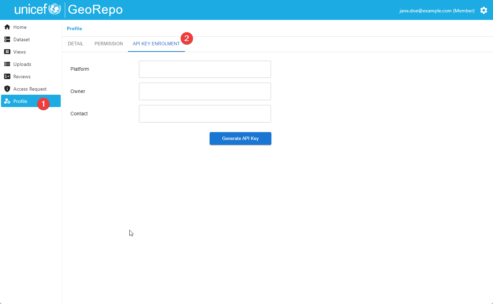
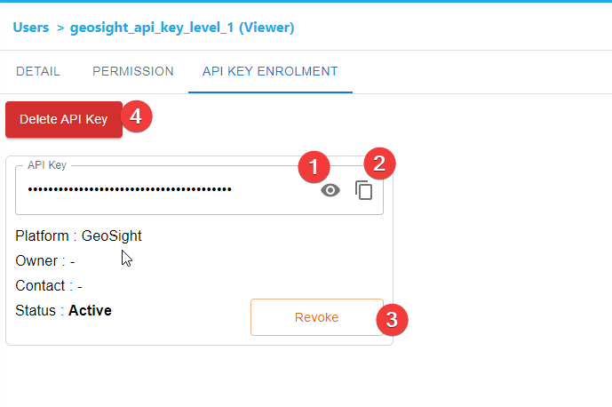

# API Guide

GeoRepo is a centralized geospatial open-source data repository platform
for managing and sharing common geospatial datasets (such as
administrative boundaries, health facilities etc.) that can be
integrated via API with other corporate systems.

GeoRepo provides access to the data through a RESTful API, available
at [https://georepo.unicef.org/api/](https://georepo.unicef.org/api/).

📔**Note:** If you have deployed your own instance, you need to use the base
domain for your instance for all examples.

In order to use the API, the user must be authenticated
and must have authorization to access the data.

GeoRepo is organized into modules. A **module** is an artifact that
groups **geospatial datasets** that share similar features and concepts.
For example, the module "Admin Boundaries" includes all the datasets
related to admin boundaries, including the "official UNICEF admin
boundaries dataset", as well as admin boundaries datasets from other
organizations and institutions.

A dataset is organized in views. A **view** is a concept similar to an
SQL view, it is a way of seeing a specific portion of a dataset. For
example, for a given dataset, there will be a view to access the whole
dataset (including previous versions), a view to see only the most
recent version of the dataset, and views defined by users to access only
specific portions of the dataset.

Finally, the data. A view is composed of a set of geographical entities,
whose meaning depends on the specific module. For example, the "Admin
Boundaries" will contain a hierarchy of countries and their
administrative divisions. In this context, a **geographical entity** is
a country when it belongs to level 0 of the hierarchy, or an
administrative division of a country when it belongs to other levels of
the hierarchy.

This means that the API will grant access to the dataset through views.

For a given geographical entities, GeoRepo provides two kinds of
identifiers:

-   Concept identifiers (**C-Ucodes**) at the level of a **geographical
    concept**. A geographical concept represents a geographical entity,
    regardless of the shapefiles attached or the versioning in the
    system. For example, "New York City". The C-Ucode is more readable
    than a UUID and includes the information about the level 0 entity
    (ISO3) code and then a progressive number to make the code unique.
    For example, #USA153674.

-   Versioned identifiers (**Ucodes**) for each **version of a
    concept**. GeoRepo is a versioning system, so any time there is an
    upload, new boundaries are compared with the existing ones and if
    the level of similarity is high enough, a new version of boundaries
    is created for a concept. For example, after three uploads, "New
    York City" will have three versions of boundaries, V1, V2, and V3,
    where V3 is the latest version. The geometries may also be the same
    for all the versions because it's an upload that causes an increment
    of the version and so the adoption of a new Ucode, even though the
    upload contains a different geometry. The Ucode is a unique
    identifier that represents a specific version. A version has a time
    range of validity, so given the C-Ucode of a concept, we can always
    access the version of boundaries that was valid at a specific date.


📔 Note that other identifiers (like PCodes, WFP codes, ISO3CD, GID, etc.)
can be available within the data if they have been uploaded together
with the data. On the other end, Ucodes and C-Ucodes are managed
directly by GeoRepo and can be used to query the API.

Let's see how to use the API and what sequence of API calls can lead us
to the discovery of geographical entities.

## How to authenticate to the API

-  🔐 API_KEY: access public data

### Generating an API KEY

Go to the Profile page and click on the `API KEY ENROLMENT` tab.



Fill in the details (Platform, Owner, and Contact) and click on the `Generate API Key` button.
Click on the `Confirm` button in the confirmation dialog.


Click on `icon 1️⃣` to see the generated API key or click on `icon 2️⃣` to copy the API key to the clipboard. The `Revoke` button can deactivate the API key so that the API key cannot be used without needing to remove it from the system. The `Delete API Key` button will remove the API key from the system.




## Examples of usage of the API

Please, note that the data in **the examples provided DO NOT reflect the
actual data in GeoRepo**. Make your own calls to get UUIDs and to
discover the existing modules, datasets, and views.

### Use Case 1: Discover a view

At the beginning, **if you do not know what is the view that you want to
use**, you must make a sequence of API calls to discover what data is
available in GeoRepo.

#### Discover the modules

The first endpoint to use is the one that lists all the modules
available in GeoRepo:

```
/search/module/list/
```
Example of response:

```json
{
  "results": [
    {
      "name": "Admin Boundaries",
      "uuid": "788a9cc7-e37d-426d-b240-0ec72f69b4c9"
    },
    {
      "name": "Boundary Lines",
      "uuid": "e1679e79-abfc-4090-8f06-630a409989bf"
    }
  ]
}
```

Let's say we are interested in the "Admin Boundaries" module. We take
its UUID ``788a9cc7-e37d-426d-b240-0ec72f69b4c9`` and use it to discover
the datasets available in this module.

#### Discover the datasets in a module

```
/search/module/788a9cc7-e37d-426d-b240-0ec72f69b4c9/dataset/list/
```

Example of response:

```json
{
  "page": 1,
  "total_page": 1,
  "page_size": 30,
  "results": [
    {
      "name": "World",
      "uuid": "2d8e9345-2ff8-41d3-9d16-65bd08ad5f3c",
      "short_code": "OAB",
      "type": "Admin Boundaries",
      "last_update": "2023-02-06T10:29:59.959780Z"
    },
    {
      "name": "World Administrative Layers",
      "uuid": "74e65901-1ecf-4e0c-84c2-17782ba4b8ae",
      "type": "Admin Boundaries",
      "last_update": "2022-10-07T21:22:43.979836Z"
    }
  ]
}
```

We have just discovered that this module has two datasets. We are
interested in the "World" dataset. If we want to get the details of the
dataset:

#### (optional) Discover the details of a dataset

```
/search/dataset/2d8e9345-2ff8-41d3-9d16-65bd08ad5f3c/
```

Example of response:

```json
{
  "name": "World",
  "uuid": "2d8e9345-2ff8-41d3-9d16-65bd08ad5f3c",
  "short_code": "OAB",
  "type": "Admin Boundaries",
  "last_update": "2023-02-06T10:29:59.959780Z",
  "dataset_levels": [
    {
      "level": 0,
      "level_name": "Country"
    },
    {
      "level": 1,
      "level_name": "Region"
    },
    {
      "level": 2,
      "level_name": "District"
    },
    {
      "level": 3,
      "level_name": "Sub-district"
    }
  ],
  "possible_id_types": [
    "ucode",
    "uuid",
    "concept_uuid",
    "PCode"
  ]
}
```

#### Discover the views in a dataset

We have obtained the UUID of the "World" dataset. Let's see what views
are available for this dataset. Views are the entry point of data; you
can access metadata and geometries of geographical entities only through
views. Some views are generated automatically when the dataset is
created: a view including all the latest data (tags "dataset" and
"latest") and a view including all the versions of all the data (tags
"dataset" and "all_versions"). In the case of hierarchical datasets,
also a view per each level 0 entity will be automatically created. Users
can create custom views using the user interface if they have
permissions. Let's list all the views in the dataset "World". Note that,
since the number of views can be very big, this endpoint has pagination,
so you have to make multiple calls changing the "page" query string
parameter to access the entire list of views.

```
/search/dataset/2d8e9345-2ff8-41d3-9d16-65bd08ad5f3c/view/list/?page=1
```

Example of response:

```json
{
  "page": 1,
  "total_page": 12,
  "page_size": 50,
  "results": [
    {
      "name": "World (All Versions)",
      "uuid": "21f21520-d6e4-4928-95cf-afac44289e7b",
      "description": "This dataset contains all the entities from main dataset",
      "dataset": "World",
      "last_update": "2023-03-10T07:52:08.090055Z",
      "vector_tiles": "https://georepo.unicef.org/layer_tiles/feda32b2-ddea-4169-8806-dc3638f0d82d/{z}/{x}/{y}?t=1678434728",
      "bbox": [-180,-90,180,83.666],
      "tags": ["all_versions","dataset"]
    },
{
      "name": "World (Latest)",
      "uuid": "408bd456-bf89-48d2-9e82-d2c9c683af8a",
      "description": "This dataset contains only the latest entities from main dataset",
      "dataset": "World",
      "last_update": "2023-03-09T12:48:50.717037Z",
      "vector_tiles": "https://georepo.unicef.org/layer_tiles/0f998fd0-8f7f-4349-ac92-84c094332fb7/{z}/{x}/{y}?t=1678366130",
      "bbox": [-180.0,-90.0,180.0,83.666],
      "tags": ["latest","dataset"]
    },
    {
      "name": "World - Argentina (All Versions)",
      "uuid": "cbbfdedb-523c-41ec-b45b-ab2f0a8b3135",
      "description": "This dataset contains all the entities from main dataset for Argentina",
      "dataset": "World",
      "root_entity": "ARG_V1",
      "last_update": "2023-03-05T20:13:54.860227Z",
      "vector_tiles": "https://georepo.unicef.org/layer_tiles/04744d38-9a5c-4de7-b1a6-f22d87dea21a/{z}/{x}/{y}?t=1676412224",
      "bbox": [-73.583,-55.061,-53.596,-21.781],
      "tags": ["all_versions","subset"]
    },
    …
  ]
}
```

### Use Case 2: Explore a view and access its data

At this point, we assume you already know what is the view that you want
to use and its UUID. In case of a hierarchical dataset, you can explore
the hierarchy in the view and access the vector
tiles/shapefiles/metadata of the geographical entities you are
interested in. If the dataset is not hierarchical, no additional
exploration is required, and you can directly access the vector
tiles/shapefiles/metadata of the geographical entities you are
interested in.

#### Flat Datasets: list all entities

If the dataset is not hierarchical, users can use an endpoint that
returns all the entities in a view (if the dataset is hierarchical, this
endpoint returns only level 0):

```
/search/view/{uuid}/entity/list
```

#### Hierarchical datasets: Navigate the hierarchy

For a hierarchical dataset, like the official admin boundary dataset, we
can navigate the hierarchy Now, our sample dataset is hierarchical, and
we are interested in the view \"World (Latest)\". Let's discover all
entities at level 0 using the UUID of the view:

```
/search/view/408bd456-bf89-48d2-9e82-d2c9c683af8a/entity/level/0/?page=1&page_size=50&geom=no_geom&format=json
```

Example of response:

```json
{
  "page": 1,
  "total_page": 6,
  "page_size": 50,
  "results": [
    {
      "ucode": "ARG_V1",
      "concept_ucode": "#ARG_1",
      "uuid": "b281e3ed-e67c-4c74-a1f7-13553bc53ee6",
      "concept_uuid": "1f3655f4-3700-4a67-927a-8fcf36bb3147",
      "is_latest": true,
      "start_date": "2022-12-20T03:43:35.632829+00:00",
      "name": "Argentina",
      "admin_level": 0,
      "type": "Country",
      "ext_codes": {"PCode": "ARG","default": "ARG"
      },
      "names": [],
      "parents": []
    },
    {
      "ucode": "ARM_V1",
      "concept_ucode": "#ARM_1",
      "uuid": "8ae13435-e433-4ef9-b3bf-a3cb3e83b824",
      "concept_uuid": "9ad40e2d-8a3c-4948-a6b1-e02725521722",
      "is_latest": true,
      "start_date": "2022-12-20T03:43:35.632829+00:00",
      "name": "Armenia",
      "admin_level": 0,
      "type": "Country",
      "ext_codes": {"PCode": "ARM","default": "ARM"},
      "names": [],
      "parents": []
    }, 
…
```

Just notice that this endpoint responds with pagination. You must call
it multiple times with different page numbers to get the entire result.

For each entity in the response, you can navigate the hierarchy by
listing the children or the parent with the endpoints:

```
/search/view/{uuid}/entity/{ucode}/children/
```

```
/search/view/{uuid}/entity/{ucode}/parent/
```

## Example of Python Code To Access the API

```
import requests

url = "https://staging-georepo.unitst.org/api/v1/search/module/list/?page=1&page_size=50"

payload = {}
headers = {
  'Accept': 'application/json',
  'Authorization': 'Token {{YOUR_API_KEY}}'
}

response = requests.request("GET", url, headers=headers, data=payload)

print(response.status_code)
print(response.json())
```

Output:
```
200
{'page': 1, 'total_page': 1, 'page_size': 50, 'results': [{'name': 'Boundary Lines', 'uuid': 'bc68f410-ce2e-466a-b64e-72974b2f228f'}, {'name': 'Admin Boundaries', 'uuid': '5118766f-83d6-4688-b79d-cb4c9110de68'}]}
```

## TO ADD

-   Find an entity version in a specific date (or the latest) given the
    Cucode

-   Alternative 3: access directly an admin level

-   How to access the geometries
