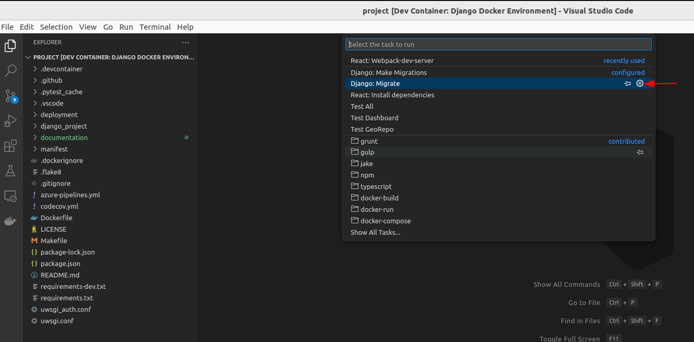
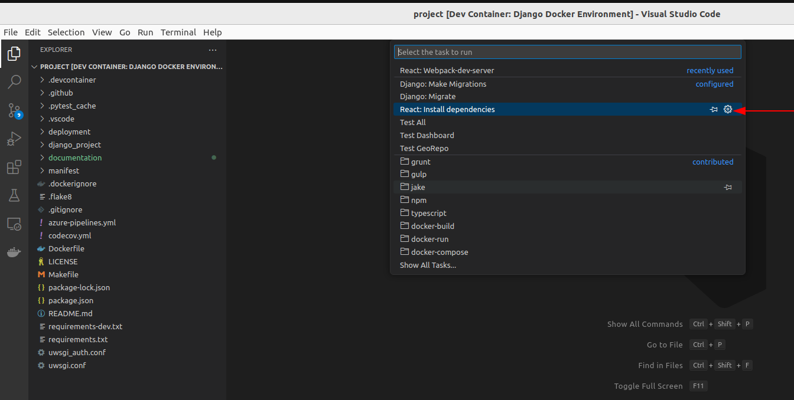
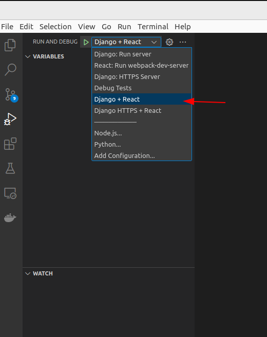
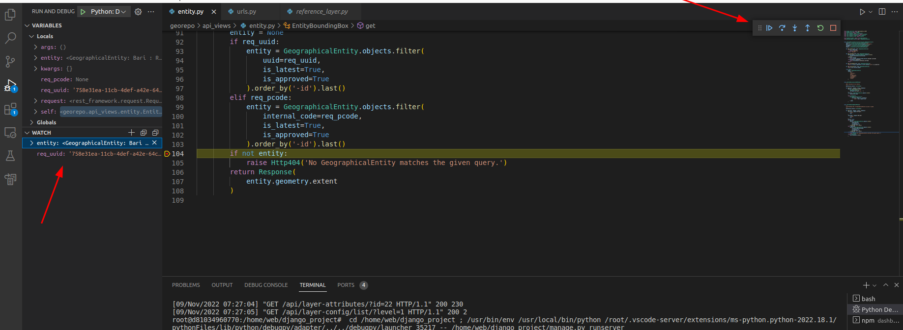

# Using VSCode

This section is for using VSCode.

Requirements:

- VSCode

- Finished **Setting up the project**

- Stop all running containers that have been run from 'make dev' command

## VSCode Installation

Download debian installer file for VSCode from this [link](https://code.visualstudio.com/download)

Install using below command:

```bash
sudo dpkg -i code_1.73.1-1667967334_amd64.deb
sudo apt-get install -f
```

Install below extensions in VSCode running in host machine:

1. Docker extension

    ```text
    @id:ms-azuretools.vscode-docker
    ```

2. DevContainer extension

    ```text
    @id:ms-vscode-remote.remote-containers
    ```

## Open the project in Dev Container
Build and open project in devcontainer: press ```Cmd+Shift+P``` (macOS) or ```Ctrl+Shift+P``` (Windows/Linux) to open the Command Palette. Type ```Dev Containers: Rebuild and Reopen in Container``` and select it to reopen the folder inside the devcontainer.


## Starting the applications
Run the migrations inside the container: Press ```Cmd+Shift+P``` (macOS) or ```Ctrl+Shift+P``` (Windows/Linux), type ```Tasks: Run Tasks``` and select it. Choose ```Django: Migrate```.


Install dependencies inside the container: Press ```Cmd+Shift+P``` (macOS) or ```Ctrl+Shift+P``` (Windows/Linux), type ```Tasks: Run Tasks``` and select it. Choose ```React: Install dependencies``` to install the necessary dependencies.



Run the project inside the container: Press ```Cmd+Shift+D``` (macOS) or ```Ctrl+Shift+D``` (Windows/Linux), choose ```Django+React``` in the RUN AND DEBUG dropdown.


Our django application is accessible in the browser through URL: <http://127.0.0.1:8000>
The react app is set with hot-reload, so once you make changes to .tsx or .scss file, the changes will be reflected in your browser.

When USE_LOCAL_SSL_SERVER=true (and using azure authentication), we need to access local development using https.
Select ```Django HTTPS+React``` and click run to start our localhost and can be accessed with https://localhost:51102.

Note: we must use localhost:51102 because Reply URL in Azure B2C Configuration has been set as the same.

This https local development is using this pluging [django-sslserver](https://github.com/teddziuba/django-sslserver)


## Environment File

VSCode will use .env that is located in django_project/.env.


## (Optional) Add Breakpoint

Select the file and go to the line that we want to add breakpoint


When the execution hits the breakpoint, we will see the toolbar to handle the breakpoint.
We can also watch variable from VSCode.


## Running Django Test

To run the test, go to remote project directory inside dev container, then we can use the below command:

```bash
python manage.py test
```
